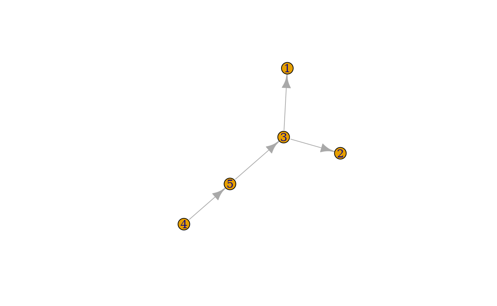

# Glycan Graphs: The Network Behind Your Sugar Structures 🕸️

**⚠️ Advanced Users Alert:** This vignette is tailored for those already
familiar with graph theory and the `igraph` package. If you’re new to
these concepts, we recommend checking out the [igraph
documentation](https://r.igraph.org) first!

## The Hidden Graph Universe of Glycans 🌌

Think of glycans as nature’s own social networks – they’re naturally
represented as directed graphs, specifically as outwardly-directed trees
where each sugar “talks” to its neighbors in a very structured way.

Behind the scenes, every
[`glycan_structure()`](https://glycoverse.github.io/glyrepr/reference/glycan_structure.md)
object is actually powered by an `igraph` object. The beauty of
`glycoverse` is that most users can work with the intuitive concept of
“glycan structures” without getting lost in the graph theory weeds 🌾.
But for you power users who want to peek under the hood – this guide is
your treasure map! 🗺️

``` r
library(glyrepr)
```

## What’s Actually Stored in Memory? 🧠

Representing a glycan in computer memory is like trying to pack for a
month-long trip in a carry-on bag – you need to decide what’s absolutely
essential!

A glycan has tons of information: linear oriented C-atoms, basetype (the
stereochemical skeleton), substituents, configuration, anomeric center,
ring size, linkage positions… the list goes on! 📝

Some packages (like Python’s `glypy`) take the “pack everything”
approach 🎒, storing every tiny detail. This comprehensive strategy is
fantastic for specialized tasks like MS/MS spectra simulation, but it
can be overkill for everyday omics research.

`glyrepr` takes a more minimalist approach ✨. Our philosophy: **if you
can derive it from an IUPAC-condensed text representation, we’ll store
it**. Everything else? We let it go. This means we skip details like
configuration and ring size – and that’s usually just fine, since common
carbohydrates have predictable properties anyway.

> 💡 **Pro Tip:** Want to master IUPAC-condensed notation? Check out
> [this comprehensive
> guide](https://glycoverse.github.io/glyrepr/articles/iupac.html).

## Extracting the Graph: Show Me the Network! 🔍

You can’t just throw `igraph` functions at a
[`glycan_structure()`](https://glycoverse.github.io/glyrepr/reference/glycan_structure.md)
object – they speak different languages! Instead, let’s extract the
underlying graph using
[`get_structure_graphs()`](https://glycoverse.github.io/glyrepr/reference/get_structure_graphs.md):

``` r
glycan <- n_glycan_core()
graph <- get_structure_graphs(glycan)
graph
#> IGRAPH be7fcc4 DN-- 5 4 -- 
#> + attr: anomer (g/c), name (v/c), mono (v/c), sub (v/c), linkage (e/c)
#> + edges from be7fcc4 (vertex names):
#> [1] 3->1 3->2 4->3 5->4
```

Let’s decode what we’re seeing here 🕵️:

**First line:** Directed Named (“DN”) graph with 5 vertices (sugar
units) and 4 edges (bonds). Think of it as a family tree with 5 people
and 4 relationships.

**Graph-level attributes:**

- `anomer` 🔄: The anomeric configuration of the reducing end (the
  “root” of our tree)

**Vertex attributes (the sugar units themselves):**

- `name` 🏷️: Unique ID for each sugar (like social security numbers)
- `mono` 🍬: The actual sugar type (“Hex”, “HexNAc”, etc.)
- `sub` ⚗️: Any chemical decorations attached to the sugar

**Edge attributes (the connections):**

- `linkage` 🔗: How the sugars are connected (including bond positions
  and configurations)

**Connection pattern:** “1-\>2” means vertex 1 connects to vertex 2. We
treat bonds as arrows pointing from the core toward the branches (even
though real glycosidic bonds aren’t actually directional – it just makes
coding easier! 😅)

Want to see it visually? `igraph` has got you covered:

``` r
plot(graph)
```



## Deep Dive: Dissecting the Components 🔬

### Vertices: Meet Your Sugar Cast 🎭

Each vertex represents a monosaccharide with three key properties:

**🏷️ Names (Unique IDs):** These are auto-generated identifiers –
usually simple integers, but they could be anything as long as they’re
unique:

``` r
igraph::V(graph)$name
#> [1] "1" "2" "3" "4" "5"
```

**🍬 Monosaccharides (The Star Players):** These are IUPAC-condensed
names like “Hex”, “HexNAc”, “Glc”, “GlcNAc”. Think of them as the “job
titles” of your sugars:

``` r
igraph::V(graph)$mono
#> [1] "Man"    "Man"    "Man"    "GlcNAc" "GlcNAc"
```

> 📚 **Reference:** For the complete cast of available monosaccharides,
> check [SNFG notation](https://www.ncbi.nlm.nih.gov/glycans/snfg.html)
> or run
> [`available_monosaccharides()`](https://glycoverse.github.io/glyrepr/reference/available_monosaccharides.md).

**⚗️ Substituents (The Accessories):** Chemical decorations like “Me”
(methyl), “Ac” (acetyl), “S” (sulfate), etc. Position matters! “3Me” =
methyl at position 3, “?S” = sulfate at unknown position:

``` r
igraph::V(graph)$sub
#> [1] "" "" "" "" ""
```

Got multiple decorations? No problem! They’re comma-separated and sorted
by position:

``` r
glycan2 <- as_glycan_structure("Glc3Me6S(a1-")
graph2 <- get_structure_graphs(glycan2)
igraph::V(graph2)$sub
#> [1] "3Me,6S"
```

### Edges: The Relationship Status 💕

Edges represent glycosidic bonds with a simple but powerful format:

    <target anomeric config><target position> - <source position>

Here’s a real example where “Gal” has an “a” anomeric configuration,
linking from position 3 of “GalNAc” to position 1 of “Gal”:

``` r
glycan3 <- as_glycan_structure("Gal(a1-3)GalNAc(b1-")
graph3 <- get_structure_graphs(glycan3)
igraph::E(graph3)$linkage
#> [1] "a1-3"
```

> 🤔 **Why encode anomer info in edges?** We debated this! It might seem
> more natural to store it with vertices, but thinking “Neu5Ac with a2-3
> linkage” flows better mentally and matches IUPAC notation perfectly.

### Graph-Level Attributes: The Global Settings ⚙️

**🔄 Anomer:** The anomeric configuration of the reducing end (the
“root” sugar that doesn’t link to anything else)

``` r
graph$anomer
#> [1] "b1"
```

## Now for the Fun Part: What Can You Do? 🎉

### Unleash the Power of `igraph` 💪

Once you understand the graph structure, the entire `igraph` universe
opens up!

**Example 1:** Count branched structures (sugars with multiple
children):

``` r
sum(igraph::degree(graph, mode = "out") > 1)
#> [1] 1
```

**Example 2:** Explore the structure with breadth-first search:

``` r
bfs_result <- igraph::bfs(graph, root = 1, mode = "out")
bfs_result$order
#> + 5/5 vertices, named, from be7fcc4:
#> [1] 1 2 3 4 5
```

### Level Up with `smap` Functions 🚀

Working with multiple glycans? You could use `purrr`:

``` r
library(purrr)

glycans <- c(n_glycan_core(), o_glycan_core_1(), o_glycan_core_2())
graphs <- get_structure_graphs(glycans)  # Extract graphs first
map_int(graphs, ~ igraph::vcount(.x))    # Then analyze
#> [1] 5 2 3
```

But `glyrepr`’s `smap` functions are way more elegant:

``` r
smap_int(glycans, ~ igraph::vcount(.x))  # Direct analysis - no intermediate step!
#> [1] 5 2 3
```

The real magic ✨ of `smap` functions is their intelligence with
duplicates. Real datasets often have many identical structures, and
`smap` optimizes by processing unique structures once, then efficiently
expanding results back to the original dimensions.

> 📖 **Learn More:** Dive deeper into `smap` wizardry in the [dedicated
> vignette](https://glycoverse.github.io/glyrepr/articles/smap.html).

### Motif Hunting with `glymotif` 🔍

One of the most exciting applications is identifying biologically
meaningful motifs (functional substructures). The `glymotif` package,
built on this graph foundation, specializes in exactly this task.

> 🎯 **Get Started:** Check out the [`glymotif`
> introduction](https://glycoverse.github.io/glymotif/articles/glymotif.html)
> to start your motif hunting adventure!

## Wrapping Up: Your Graph Journey Continues 🎯

You’ve just unlocked the graph-powered engine behind `glyrepr`! You now
understand:

- 🏗️ How glycan structures map to directed graphs
- 📊 What information is stored (and what’s deliberately omitted)
- 🔧 How to extract and manipulate the underlying graphs
- 🚀 How to leverage `igraph`, `smap`, and `glymotif` for powerful
  analyses

The graph representation might seem complex at first, but it’s this
solid foundation that enables all the sophisticated glycan analysis
capabilities in the `glycoverse`. Now go forth and explore your glycan
networks! 🌟
