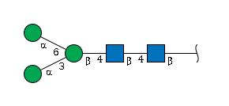

# Decoding Glycans: Your Guide to IUPAC-Condensed Format

Welcome to the fascinating world of glycan notation! If you’ve ever
looked at a glycan structure and wondered, “How on earth do I turn this
beautiful tree-like molecule into text?”, you’re in exactly the right
place. Today we’re diving into IUPAC-condensed format — the goldilocks
of glycan notation that’s “just right” for most glycomics work.

``` r
library(glyrepr)
```

## The Tower of Babel: Why So Many Glycan Formats? 🏗️

Picture this: you’re at an international conference, and everyone is
speaking a different language. That’s exactly what happened in the
glycomics world! Different communities developed their own ways to
describe glycans, each optimized for their specific needs.

Let’s take a famous N-glycan as our example:


**The same molecule, many faces:**

**The Human-Friendly Version (IUPAC-condensed):**

    Neu5Ac(a2-3)Gal(b1-4)GlcNAc(b1-2)Man(a1-3)[Neu5Ac(a2-3)Gal(b1-4)GlcNAc(b1-2)Man(a1-6)]Man(b1-4)GlcNAc(b1-4)[Fuc(a1-6)]GlcNAc(b1-

**The Chemistry Professor’s Dream (IUPAC-extended):**

    α-D-Neup5Ac-(2→3)-β-D-Galp-(1→4)-β-D-GlcpNAc-(1→2)-α-D-Manp-(1→3)[α-D-Neup5Ac-(2→3)-β-D-Galp-(1→4)-β-D-GlcpNAc-(1→2)-α-D-Manp-(1→6)]-β-D-Manp-(1→4)-β-D-GlcpNAc-(1→4)[α-L-Fucp-(1→6)]-β-D-GlcpNAc-(1→

**The Computer’s Favorite (WURCS):**

    WURCS=2.0/6,12,11/[a2122h-1b_1-5_2*NCC/3=O][a1122h-1b_1-5][a1122h-1a_1-5][a2112h-1b_1-5][Aad21122h-2a_2-6_5*NCC/3=O][a1221m-1a_1-5]/1-1-2-3-1-4-5-3-1-4-5-6/a4-b1_a6-l1_b4-c1_c3-d1_c6-h1_d2-e1_e4-f1_f3-g2_h2-i1_i4-j1_j3-k2

**The Chemical Database’s Language (InChI):**

    InChI=1S/C90H148N6O66/c1-21-47(116)59(128)62(131)81(142-21)140-20-40-69(55(124)43(77(135)143-40)93-24(4)108)152-78-44(94-25(5)109)56(125)66(36(16-103)148-78)153-82-63(132)72(156-86-76(61(130)51(120)33(13-100)147-86)158-80-46(96-27(7)111)58(127)68(38(18-105)150-80)155-84-65(134)74(53(122)35(15-102)145-84)162-90(88(138)139)9-29(113)42(92-23(3)107)71(160-90)49(118)31(115)11-98)54(123)39(151-82)19-141-85-75(60(129)50(119)32(12-99)146-85)157-79-45(95-26(6)110)57(126)67(37(17-104)149-79)154-83-64(133)73(52(121)34(14-101)144-83)161-89(87(136)137)8-28(112)41(91-22(2)106)70(159-89)48(117)30(114)10-97/h21,28-86,97-105,112-135H,8-20H2,1-7H3,(H,91,106)(H,92,107)(H,93,108)(H,94,109)(H,95,110)(H,96,111)(H,136,137)(H,138,139)/t21-,28-,29-,30+,31+,32+,33+,34+,35+,36+,37+,38+,39+,40+,41+,42+,43+,44+,45+,46+,47+,48+,49+,50+,51+,52-,53-,54+,55+,56+,57+,58+,59+,60-,61-,62-,63-,64+,65+,66+,67+,68+,69+,70+,71+,72-,73-,74-,75-,76-,77+,78-,79-,80-,81+,82-,83-,84-,85-,86+,89-,90-/m0/s1

**Feeling dizzy yet?** 😵‍💫 That’s completely normal! Each format serves
its purpose:

- 🧑‍🔬 **IUPAC formats**: Perfect for humans to read and understand
- 🤖 **WURCS/GlycoCT**: Optimized for computers and databases
- 🔗 **Semantic formats**: Great for linking data across platforms
- ⚗️ **Chemical formats**: Ideal for rigorous chemical analysis

## Why We Chose IUPAC-Condensed for `glyrepr` 🎯

When we were building the `glycoverse`, we faced a classic engineering
decision: which format should be our “native language”?

After much deliberation (and probably too much coffee ☕), we settled on
**IUPAC-condensed** because it hits the sweet spot:

✅ **Human-readable**: You can actually understand what you’re looking
at  
✅ **Information-rich**: Contains everything you need for most glycomics
analyses  
✅ **Widely used**: The glycomics community knows and loves it  
✅ **Flexible**: Works for both simple and complex structures

Think of it as the “Python of glycan formats” — powerful yet
approachable!

## Mastering IUPAC-Condensed: A Step-by-Step Journey 🗺️

### Step 1: The Building Blocks — Monosaccharide Symbols

Every glycan is built from monosaccharide units, and IUPAC gives each
one a memorable abbreviation:

| Full Name           | Symbol   | Think of it as…        |
|---------------------|----------|------------------------|
| Galactose           | `Gal`    | “**Gal**axy sugar”     |
| Glucose             | `Glc`    | “**Glc**ucose” (easy!) |
| Mannose             | `Man`    | “**Man**nose”          |
| N-Acetylglucosamine | `GlcNAc` | “Glc + NAc”            |
| Fucose              | `Fuc`    | “**Fuc**ose”           |

💡 **Pro tip**: Check out the [SNFG
website](https://www.ncbi.nlm.nih.gov/glycans/snfg.html) for the
complete symbol library — it’s like a cheat sheet for glycan notation!

### Step 2: The Decorations — Substituents

Just like proteins can have post-translational modifications, glycans
can have their own decorations! These are called **substituents**.

Think of substituents as “accessories” for your monosaccharides:

- `Neu5Ac9Ac` = A sialic acid wearing an extra acetyl group at position
  9
- `Glc3Me` = A glucose sporting a methyl group at position 3
- `GlcNAc6Ac` = An N-acetylglucosamine with bonus acetylation at
  position 6

**Format rule**: Position number + Modification type  
Example: `6Ac` = “acetyl group at position 6”

### Step 3: The Connections — Linkage Information

This is where the magic happens! 🪄 Linkages tell us how monosaccharides
are connected to each other.

**The anatomy of a linkage:**

    MonosaccharideA(anomeric_config + anomeric_position - target_position)MonosaccharideB

Let’s decode `Neu5Ac(a2-3)Gal`:

- `Neu5Ac` is connected to `Gal`
- The anomeric carbon of `Neu5Ac` is in **alpha** configuration (`a`)
- The connection is from position **2** of `Neu5Ac`
- To position **3** of `Gal`

**Real-world analogy**: Think of it like describing how LEGO blocks
connect: “The red block connects from its 2nd peg (in up position) to
the 3rd socket of the blue block.”

**When life gets uncertain** 🤷‍♀️: Sometimes we don’t know all the
details, so we use `?` as a wildcard:

- `a2-?` = “We know it’s alpha-2, but not sure where it connects”
- `??-3` = “It connects to position 3, but the anomeric info is unclear”

### Step 4: The Architecture — Topological Structure

Now comes the fun part: turning a branched tree structure into a linear
string! It’s like giving directions to a complex building.

**The golden rules:**

1.  **Find the longest backbone** (like the main hallway)
2.  **Everything else is a branch** (like rooms off the hallway)
3.  **Branches go in square brackets `[]`**
4.  **Write branches just before the monosaccharide they connect to**
5.  **Perform 1-4 for each branch**

#### Example 1: A Simple O-Glycan 🌿


**Step-by-step construction:**

1.  **Identify the main chain**: `Gal → GlcNAc → GalNAc`
2.  **Add linkage info**: `Gal(b1-4)GlcNAc(b1-6)GalNAc(a1-`
3.  **Spot the branch**: The bottom `Gal` connects to `GalNAc`
4.  **Insert the branch**: `Gal(b1-4)GlcNAc(b1-6)[Gal(b1-3)]GalNAc(a1-`
5.  The branch is a single “Gal(b1-3)” unit, no need for step 5.

**Final result**:

    Gal(b1-4)GlcNAc(b1-6)[Gal(b1-3)]GalNAc(a1-

#### Example 2: The Famous N-Glycan Core 🌟



**The plot twist**: Two chains of equal length! Which one becomes the
main chain?

**IUPAC’s tie-breaker rule**: When chains are equal, choose the one that
creates branches with **lower position numbers**.

**Analysis:** - Option A: `Man(a1-6)` branch → position 6 - Option B:
`Man(a1-3)` branch → position 3

**Winner**: Option B (lower number = 3)

**Final result**:

    Man(a1-3)[Man(a1-6)]Man(b1-4)GlcNAc(b1-4)GlcNAc(b1-

#### Example 3:


Let’s look at one more example to solidify our understanding. This
example is a bit more complex, as it has three branches with the same
length, branching on different residues. In this case, we look for the
first breaking point from right to left: the b4 Man. Two mannoses are
connected to the Man, one with a1-3 linkage and the other with a1-6
linkage. According to the tie breaking law, we choose the bottom one
(a1-3) as the main chain. Let’s write out the main chain first.

    Man(a1-2)Man(a1-2)Man(a1-3)[BRANCH]Man(b1-4)GlcNAc(b1-4)GlcNAc(b1-

Now let’s look at the branch, which itself has branches too (highlighed
part).


The IUPAC-condensed string of the branch goes (using the tie breaking
law again):

    BRANCH = Man(a1-2)Man(a1-3)[Man(a1-2)Man(a1-6)]Man(a1-6)

Let’s combine them together:

    Man(a1-2)Man(a1-2)Man(a1-3)[Man(a1-2)Man(a1-3)[Man(a1-2)Man(a1-6)]Man(a1-6)]Man(b1-4)GlcNAc(b1-4)GlcNAc(b1-

### Step 5: The Root Mystery — Anomeric Information

You might wonder: “Why does the last monosaccharide end with `(b1-`
instead of a complete linkage?”

Great question! 🤔 The root monosaccharide (rightmost) doesn’t connect
to anything further, so its anomeric carbon is “free.” The format `(xy-`
tells us about its anomeric state without a target.

## Put Your Skills to the Test! 🧪

Ready to become an IUPAC-condensed master? Time for some hands-on
practice!

**Challenge**: Look at the complex N-glycan at the beginning of this
article and try to write its IUPAC-condensed string yourself. Don’t peek
at the answer!

**Hint**: Start by identifying the main chain, then work on the branches
one by one.

**Test your answer:**

``` r
# Try your hand-written string here!
my_attempt <- "Your_IUPAC_string_here"

# This will tell you if it's valid
tryCatch({
  result <- as_glycan_structure(my_attempt)
  cat("🎉 Congratulations! Your IUPAC string is valid!\n")
  print(result)
}, error = function(e) {
  cat("🔧 Oops! There might be a small issue. Keep trying!\n")
  cat("Error:", e$message, "\n")
})
#> 🔧 Oops! There might be a small issue. Keep trying!
#> Error: In index: 1.
```

## Congratulations, You’re Now Glycan-Literate! 🎓

You’ve just mastered one of the most important skills in computational
glycomics: reading and writing IUPAC-condensed notation. This knowledge
will serve you well as you explore the `glycoverse` and analyze glycan
structures.

**What you’ve learned:**

- 🧬 Why different glycan formats exist and when to use them
- 🔤 How to decode monosaccharide symbols and substituents  
- 🔗 The logic behind linkage notation
- 🌳 How to convert tree structures into linear strings
- 🎯 The art of identifying main chains and branches

**Next steps:**

- Practice with more complex structures
- Explore the `glyrepr` package functions
- Dive into glycan analysis with confidence!

Happy glycan hunting! 🕵️‍♀️✨

## Session Information

``` r
sessionInfo()
#> R version 4.5.2 (2025-10-31)
#> Platform: x86_64-pc-linux-gnu
#> Running under: Ubuntu 24.04.3 LTS
#> 
#> Matrix products: default
#> BLAS:   /usr/lib/x86_64-linux-gnu/openblas-pthread/libblas.so.3 
#> LAPACK: /usr/lib/x86_64-linux-gnu/openblas-pthread/libopenblasp-r0.3.26.so;  LAPACK version 3.12.0
#> 
#> locale:
#>  [1] LC_CTYPE=C.UTF-8       LC_NUMERIC=C           LC_TIME=C.UTF-8       
#>  [4] LC_COLLATE=C.UTF-8     LC_MONETARY=C.UTF-8    LC_MESSAGES=C.UTF-8   
#>  [7] LC_PAPER=C.UTF-8       LC_NAME=C              LC_ADDRESS=C          
#> [10] LC_TELEPHONE=C         LC_MEASUREMENT=C.UTF-8 LC_IDENTIFICATION=C   
#> 
#> time zone: UTC
#> tzcode source: system (glibc)
#> 
#> attached base packages:
#> [1] stats     graphics  grDevices utils     datasets  methods   base     
#> 
#> other attached packages:
#> [1] glyrepr_0.10.0.9000
#> 
#> loaded via a namespace (and not attached):
#>  [1] vctrs_0.7.1       cli_3.6.5         knitr_1.51        rlang_1.1.7      
#>  [5] xfun_0.56         stringi_1.8.7     purrr_1.2.1       generics_0.1.4   
#>  [9] textshaping_1.0.4 jsonlite_2.0.0    glue_1.8.0        htmltools_0.5.9  
#> [13] ragg_1.5.0        sass_0.4.10       rmarkdown_2.30    tibble_3.3.1     
#> [17] evaluate_1.0.5    jquerylib_0.1.4   fastmap_1.2.0     yaml_2.3.12      
#> [21] lifecycle_1.0.5   stringr_1.6.0     compiler_4.5.2    dplyr_1.2.0      
#> [25] fs_1.6.6          pkgconfig_2.0.3   systemfonts_1.3.1 digest_0.6.39    
#> [29] R6_2.6.1          tidyselect_1.2.1  pillar_1.11.1     magrittr_2.0.4   
#> [33] bslib_0.10.0      tools_4.5.2       pkgdown_2.2.0     cachem_1.1.0     
#> [37] desc_1.4.3
```
