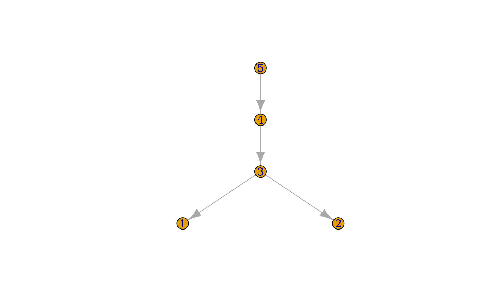

# Glycan Graphs: The Network Behind Glycan Structures

This vignette is for users who want to understand how `glyrepr` stores
glycan structures internally. Some familiarity with graph theory and the
`igraph` package will help. If those concepts are new to you, the
[igraph documentation](https://r.igraph.org) is a useful companion
reference.

## Glycans as Graphs

Glycans are naturally represented as directed graphs. In `glyrepr`, an
ordinary glycan structure is stored as an outward-directed tree, where
each vertex represents a monosaccharide and each edge represents a
glycosidic linkage. A structure with floating parts is stored as an
annotated forest: one main tree plus one disconnected tree for each
floating part.

Behind the scenes, each
[`glycan_structure()`](https://glycoverse.github.io/glyrepr/dev/reference/glycan_structure.md)
object is backed by an `igraph` object. Most workflows can stay at the
[`glycan_structure()`](https://glycoverse.github.io/glyrepr/dev/reference/glycan_structure.md)
level, but the graph representation is useful when you need custom
structure analysis.

``` r

library(glyrepr)
```

## What Is Stored in Memory?

A glycan can carry many kinds of information: linear oriented C-atoms,
basetype, substituents, configuration, anomeric center, ring size,
linkage positions, and more.

Some packages, such as Python’s `glypy`, store a very detailed glycan
model. That comprehensive strategy is useful for specialized tasks such
as MS/MS spectra simulation, but it can be overkill for everyday omics
research.

`glyrepr` takes a more compact approach: if a feature can be derived
from an IUPAC-condensed text representation, `glyrepr` stores it.
Details such as configuration and ring size are not stored directly,
because they are often predictable for common carbohydrates and are not
needed for many glycomics workflows.

For a closer look at IUPAC-condensed notation, see the [IUPAC-condensed
vignette](https://glycoverse.github.io/glyrepr/articles/iupac.html).

## Extracting the Graph

You cannot pass a
[`glycan_structure()`](https://glycoverse.github.io/glyrepr/dev/reference/glycan_structure.md)
object directly to most `igraph` functions. First, extract the
underlying graph with
[`get_structure_graphs()`](https://glycoverse.github.io/glyrepr/dev/reference/get_structure_graphs.md):

``` r

glycan <- n_glycan_core()
graph <- get_structure_graphs(glycan)
graph
#> IGRAPH 71c2f2b DN-- 5 4 -- 
#> + attr: anomer (g/c), alditol (g/l), name (v/c), mono (v/c), sub (v/c),
#> | linkage (e/c)
#> + edges from 71c2f2b (vertex names):
#> [1] 3->1 3->2 4->3 5->4
```

The printed graph contains several pieces of information.

**First line:** Directed Named (“DN”) graph with 5 vertices (sugar
units) and 4 edges (bonds).

**Graph-level attributes:**

- `anomer`: the anomeric configuration of the reducing end.
- `alditol`: whether the reducing-end residue is an alditol.
- `floating_parts`, when present: virtual attachment metadata for
  disconnected floating components.
- `floating_substituents`, when present: unresolved substituent tokens
  and their candidate parent residues.

**Vertex attributes:**

- `name`: a unique ID for each monosaccharide.
- `mono`: the monosaccharide type, such as “Hex” or “HexNAc”.
- `sub`: chemical decorations attached to the monosaccharide.

**Edge attributes:**

- `linkage`: how the monosaccharides are connected, including bond
  positions and configurations.

**Connection pattern:** “1-\>2” means vertex 1 connects to vertex 2.
`glyrepr` treats bonds as arrows pointing from the core toward the
branches. The direction is a modeling choice that makes traversal and
structure operations easier.

You can also plot the graph with `igraph`:

``` r

plot(graph)
```



## Graph Components

### Vertices

Each vertex represents a monosaccharide with three key properties:

**Names:** These are auto-generated identifiers, usually simple
integers, but they could be anything as long as they’re unique:

``` r

igraph::V(graph)$name
#> [1] "1" "2" "3" "4" "5"
```

**Monosaccharides:** These are IUPAC-condensed names like “Hex”,
“HexNAc”, “Glc”, “GlcNAc”.

``` r

igraph::V(graph)$mono
#> [1] "Man"    "Man"    "Man"    "GlcNAc" "GlcNAc"
```

For the full list of available monosaccharides, check [SNFG
notation](https://www.ncbi.nlm.nih.gov/glycans/snfg.html) or run
[`available_monosaccharides()`](https://glycoverse.github.io/glyrepr/dev/reference/available_monosaccharides.md).

**Substituents:** Chemical decorations like “Me” (methyl), “Ac”
(acetyl), “S” (sulfate), etc. Position matters. “3Me” = methyl at
position 3, “?S” = sulfate at unknown position:

``` r

igraph::V(graph)$sub
#> [1] "" "" "" "" ""
```

Multiple decorations are comma-separated and sorted by position:

``` r

glycan2 <- as_glycan_structure("Glc3Me6S(a1-")
graph2 <- get_structure_graphs(glycan2)
igraph::V(graph2)$sub
#> [1] "3Me,6S"
```

### Edges

Edges represent glycosidic bonds with a simple but powerful format:

    <target anomeric config><target position> - <source position>

Here is an example where “Gal” has an “a” anomeric configuration,
linking from position 3 of “GalNAc” to position 1 of “Gal”:

``` r

glycan3 <- as_glycan_structure("Gal(a1-3)GalNAc(b1-")
graph3 <- get_structure_graphs(glycan3)
igraph::E(graph3)$linkage
#> [1] "a1-3"
```

`glyrepr` stores anomer information in edges rather than vertices. This
follows the way linkages are written in IUPAC-condensed notation, for
example “Neu5Ac with an a2-3 linkage”.

### Graph-Level Attributes

**Anomer:** The anomeric configuration of the reducing end.

``` r

graph$anomer
#> [1] "b1"
```

**Alditol:** Whether the reducing-end residue has been reduced. The
attribute is always explicit on canonical graphs; legacy inputs without
it are treated as `FALSE`. In IUPAC-condensed strings, `-ol` follows the
reducing-end residue.

``` r

alditol <- as_glycan_structure("Gal(b1-4)GlcNAc-ol(a1-")
alditol_graph <- get_structure_graphs(alditol)
alditol_graph$alditol
#> [1] TRUE
get_alditol(alditol)
#> [1] TRUE
```

### Floating Parts

A floating structure remains one `igraph`, but it is weakly
disconnected. The floating-component vertices come first in complete
IUPAC-condensed order, followed by the main-tree vertices in their
canonical order.

``` r

floating <- as_glycan_structure(
  "{Neu5Ac(a2-3)|2,3}Gal(b1-3)[Gal(b1-4)]GlcNAc(a1-"
)
floating_graph <- get_structure_graphs(floating)

igraph::components(floating_graph, mode = "weak")$no
#> [1] 2
igraph::graph_attr(floating_graph, "floating_parts")
#> [[1]]
#> [[1]]$root
#> [1] 1
#> 
#> [[1]]$nodes
#> [1] 1
#> 
#> [[1]]$linkage
#> [1] "a2-3"
#> 
#> [[1]]$parents
#> [1] 2 3
structure_floating_parts(floating)
#> # A tibble: 1 × 6
#>   glycan_id part_id root_node nodes     linkage parents  
#>       <int>   <int>     <int> <list>    <chr>   <list>   
#> 1         1       1         1 <int [1]> a2-3    <int [2]>
```

Each `floating_parts` entry has four fields:

- `root`: the vertex index at the root of the floating component.
- `nodes`: every vertex index in the floating component.
- `linkage`: the virtual linkage from that root to its unresolved
  parent.
- `parents`: candidate vertex indices outside the component.
  [`integer()`](https://rdrr.io/r/base/integer.html) means all feasible
  nodes outside that component, including nodes in other floating parts.
  In a canonical structure, an explicit vector has at least two entries;
  a singleton is normalized to an ordinary edge.

These IDs follow complete IUPAC-condensed residue order: floating blocks
are counted from left to right before the main glycan, and substituent
blocks add no vertices. Component assignments must be acyclic and
ultimately connect to the main tree.

The virtual attachment is not stored in `igraph::E(floating_graph)`,
because its endpoint is unresolved. Use
[`structure_floating_parts()`](https://glycoverse.github.io/glyrepr/dev/reference/structure_tables.md)
when a tabular representation must round-trip this metadata.

### Floating Substituents

Floating substituents use the same candidate-parent convention without
adding dummy vertices. Each `floating_substituents` entry contains
`substituent`, such as `"6S"` or `"?S"`, and `parents`. Empty `parents`
means every feasible residue node in the complete structure, including
floating-part nodes; otherwise the values are global graph vertex
indices.

``` r

floating_sub <- as_glycan_structure(
  "{6S|1,2}Gal(a1-3)Glc(a1-3)Man(a1-"
)
floating_sub_graph <- get_structure_graphs(floating_sub)
igraph::graph_attr(floating_sub_graph, "floating_substituents")
#> [[1]]
#> [[1]]$substituent
#> [1] "6S"
#> 
#> [[1]]$parents
#> [1] 1 2
structure_floating_substituents(floating_sub)
#> # A tibble: 1 × 4
#>   glycan_id substituent_id substituent parents  
#>       <int>          <int> <chr>       <list>   
#> 1         1              1 6S          <int [2]>
```

## Working with the Graph

### Using `igraph`

Once you understand the graph structure, you can use `igraph` functions
for custom structure analysis. Remember that tree-specific functions
need special handling for a structure with floating parts:
[`get_structure_graphs()`](https://glycoverse.github.io/glyrepr/dev/reference/get_structure_graphs.md)
and
[`smap()`](https://glycoverse.github.io/glyrepr/dev/reference/smap.md)
pass the complete annotated forest, not only the main tree.

**Example 1:** Count branched structures (sugars with multiple
children):

``` r

sum(igraph::degree(graph, mode = "out") > 1)
#> [1] 1
```

**Example 2:** Explore the structure with breadth-first search:

``` r

bfs_result <- igraph::bfs(graph, root = 1, mode = "out")
bfs_result$order
#> + 5/5 vertices, named, from 71c2f2b:
#> [1] 1 2 3 4 5
```

### Using `smap` Functions

Working with multiple glycans? You could use `purrr`:

``` r

library(purrr)

glycans <- c(n_glycan_core(), o_glycan_core_1(), o_glycan_core_2())
graphs <- get_structure_graphs(glycans)  # Extract graphs first
map_int(graphs, ~ igraph::vcount(.x))    # Then analyze
#> [1] 5 2 3
```

For glycan structure vectors, `glyrepr`’s `smap` functions are usually a
better fit:

``` r

smap_int(glycans, ~ igraph::vcount(.x))  # Direct analysis, no intermediate step.
#> [1] 5 2 3
```

The main advantage of `smap` functions is how they handle duplicates.
Real datasets often contain many repeated structures, and `smap`
optimizes by processing unique structures once, then efficiently
expanding results back to the original dimensions.

The [smap
vignette](https://glycoverse.github.io/glyrepr/articles/smap.html)
covers this workflow in more detail.

### Motif Analysis with `glymotif`

One important application is identifying biologically meaningful motifs,
or functional substructures. The `glymotif` package, built on this graph
foundation, specializes in exactly this task.

See the [`glymotif`
introduction](https://glycoverse.github.io/glymotif/articles/glymotif.html)
for examples.

## Summary

In this vignette, you saw:

- how glycan structures map to directed graphs.
- what information is stored and what is deliberately omitted.
- how to extract and inspect the underlying graphs.
- how `igraph`, `smap`, and `glymotif` can build on this representation.

The graph representation might seem complex at first, but it’s this
solid foundation that enables all the sophisticated glycan analysis
capabilities in the `glycoverse`. Most users will not need to manipulate
the graph directly, but understanding the model makes it easier to
extend `glyrepr` when custom analysis is needed.
