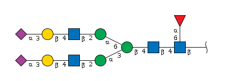
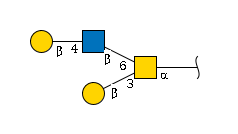
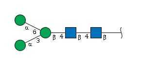
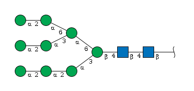
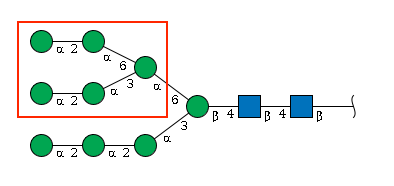

# IUPAC-Condensed Glycan Notation

This article introduces IUPAC-condensed glycan notation, the main text
format used by `glyrepr` for representing glycan structures. The goal is
to show how a branched glycan structure can be written as a compact,
readable string.

``` r
library(glyrepr)
```

## Why Are There So Many Glycan Formats?

Different communities have developed different ways to describe glycans,
each optimized for a specific use case. Some formats are easy for people
to read, some are better for databases and software, and others preserve
detailed chemical information.

Let’s use one N-glycan as an example:



**The same molecule can be written in several formats:**

**IUPAC-condensed:**

    Neu5Ac(a2-3)Gal(b1-4)GlcNAc(b1-2)Man(a1-3)[Neu5Ac(a2-3)Gal(b1-4)GlcNAc(b1-2)Man(a1-6)]Man(b1-4)GlcNAc(b1-4)[Fuc(a1-6)]GlcNAc(b1-

**IUPAC-extended:**

    α-D-Neup5Ac-(2→3)-β-D-Galp-(1→4)-β-D-GlcpNAc-(1→2)-α-D-Manp-(1→3)[α-D-Neup5Ac-(2→3)-β-D-Galp-(1→4)-β-D-GlcpNAc-(1→2)-α-D-Manp-(1→6)]-β-D-Manp-(1→4)-β-D-GlcpNAc-(1→4)[α-L-Fucp-(1→6)]-β-D-GlcpNAc-(1→

**WURCS:**

    WURCS=2.0/6,12,11/[a2122h-1b_1-5_2*NCC/3=O][a1122h-1b_1-5][a1122h-1a_1-5][a2112h-1b_1-5][Aad21122h-2a_2-6_5*NCC/3=O][a1221m-1a_1-5]/1-1-2-3-1-4-5-3-1-4-5-6/a4-b1_a6-l1_b4-c1_c3-d1_c6-h1_d2-e1_e4-f1_f3-g2_h2-i1_i4-j1_j3-k2

**InChI:**

    InChI=1S/C90H148N6O66/c1-21-47(116)59(128)62(131)81(142-21)140-20-40-69(55(124)43(77(135)143-40)93-24(4)108)152-78-44(94-25(5)109)56(125)66(36(16-103)148-78)153-82-63(132)72(156-86-76(61(130)51(120)33(13-100)147-86)158-80-46(96-27(7)111)58(127)68(38(18-105)150-80)155-84-65(134)74(53(122)35(15-102)145-84)162-90(88(138)139)9-29(113)42(92-23(3)107)71(160-90)49(118)31(115)11-98)54(123)39(151-82)19-141-85-75(60(129)50(119)32(12-99)146-85)157-79-45(95-26(6)110)57(126)67(37(17-104)149-79)154-83-64(133)73(52(121)34(14-101)144-83)161-89(87(136)137)8-28(112)41(91-22(2)106)70(159-89)48(117)30(114)10-97/h21,28-86,97-105,112-135H,8-20H2,1-7H3,(H,91,106)(H,92,107)(H,93,108)(H,94,109)(H,95,110)(H,96,111)(H,136,137)(H,138,139)/t21-,28-,29-,30+,31+,32+,33+,34+,35+,36+,37+,38+,39+,40+,41+,42+,43+,44+,45+,46+,47+,48+,49+,50+,51+,52-,53-,54+,55+,56+,57+,58+,59+,60-,61-,62-,63-,64+,65+,66+,67+,68+,69+,70+,71+,72-,73-,74-,75-,76-,77+,78-,79-,80-,81+,82-,83-,84-,85-,86+,89-,90-/m0/s1

Each format serves its purpose:

- **IUPAC formats**: readable text formats for describing glycan
  structures.
- **WURCS/GlycoCT**: structured formats designed for databases and
  software.
- **Semantic formats**: formats designed for linking data across
  platforms.
- **Chemical formats**: formats used for detailed chemical
  representation.

## Why `glyrepr` Uses IUPAC-Condensed

When building `glyrepr`, we needed a native text format for glycan
structures. IUPAC-condensed is a practical choice because it balances
readability and information content.

- **Human-readable**: structures can usually be interpreted without
  specialized software.
- **Information-rich**: it captures the monosaccharides, branches,
  linkages, anomers, and substituents needed for many glycomics
  analyses.
- **Widely used**: it is familiar to many researchers in the glycomics
  community.
- **Flexible**: it can represent both simple and complex glycan
  structures.

For other formats such as WURCS or GlycoCT, the broader `glycoverse`
workflow can use parser packages such as `glyparse`.

## Reading IUPAC-Condensed Notation

### Step 1: Monosaccharide Symbols

Every glycan is built from monosaccharide units, and IUPAC notation
gives each one a short abbreviation:

| Full Name           | Symbol   |
|---------------------|----------|
| Galactose           | `Gal`    |
| Glucose             | `Glc`    |
| Mannose             | `Man`    |
| N-Acetylglucosamine | `GlcNAc` |
| Fucose              | `Fuc`    |

For a broader list of symbols, see the [SNFG
website](https://www.ncbi.nlm.nih.gov/glycans/snfg.html) or run
[`available_monosaccharides()`](https://glycoverse.github.io/glyrepr/dev/reference/available_monosaccharides.md).

### Step 2: Substituents

Glycans can contain chemical modifications called **substituents**. In
IUPAC-condensed notation, substituents are written after the
monosaccharide name.

- `Neu5Ac9Ac` = a sialic acid with an extra acetyl group at position 9.
- `Glc3Me` = a glucose with a methyl group at position 3.
- `GlcNAc6Ac` = an N-acetylglucosamine with acetylation at position 6.

**Format rule**: Position number + Modification type  
Example: `6Ac` = “acetyl group at position 6”

### Step 3: Linkage Information

Linkages tell us how monosaccharides are connected to each other.

**The anatomy of a linkage:**

    MonosaccharideA(anomeric_config + anomeric_position - target_position)MonosaccharideB

For example, `Neu5Ac(a2-3)Gal` means:

- `Neu5Ac` is connected to `Gal`
- The anomeric carbon of `Neu5Ac` is in **alpha** configuration (`a`)
- The connection is from position **2** of `Neu5Ac`
- To position **3** of `Gal`

Sometimes not all linkage details are known, so we use `?` as a
wildcard:

- `a2-?` = the anomer and donor position are known, but the acceptor
  position is unknown.
- `??-3` = the acceptor position is known, but the anomer and donor
  position are unknown.

### Step 4: Topological Structure

The main challenge in IUPAC-condensed notation is writing a branched
tree as a linear string. Branches are placed in square brackets and
inserted before the residue they attach to.

The basic rules are:

1.  **Find the longest backbone**
2.  **Treat everything else as a branch**
3.  **Branches go in square brackets `[]`**
4.  **Write branches just before the monosaccharide they connect to**
5.  **Apply the same rules recursively inside each branch**

#### Example 1: A Simple O-Glycan



**Step-by-step construction:**

1.  **Identify the main chain**: `Gal -> GlcNAc -> GalNAc`
2.  **Add linkage info**: `Gal(b1-4)GlcNAc(b1-6)GalNAc(a1-`
3.  **Spot the branch**: The bottom `Gal` connects to `GalNAc`
4.  **Insert the branch**: `Gal(b1-4)GlcNAc(b1-6)[Gal(b1-3)]GalNAc(a1-`
5.  The branch is a single “Gal(b1-3)” unit, no need for step 5.

**Final result**:

    Gal(b1-4)GlcNAc(b1-6)[Gal(b1-3)]GalNAc(a1-

#### Example 2: The N-Glycan Core



This example has two chains of equal length. The tie-breaker rule
decides which one becomes the main chain.

**IUPAC’s tie-breaker rule**: When chains are equal, choose the one that
creates branches with **lower position numbers**.

**Analysis:** - Option A: `Man(a1-6)` branch -\> position 6 - Option B:
`Man(a1-3)` branch -\> position 3

Option B is chosen because 3 is lower than 6.

**Final result**:

    Man(a1-3)[Man(a1-6)]Man(b1-4)GlcNAc(b1-4)GlcNAc(b1-

#### Example 3:



This example is more complex: it has three branches with the same
length, branching on different residues. In this case, we look for the
first breaking point from right to left: the b4 Man. Two mannoses are
connected to that Man, one with an a1-3 linkage and the other with an
a1-6 linkage. According to the tie-breaker rule, we choose the a1-3
branch as the main chain. First, write the main chain:

    Man(a1-2)Man(a1-2)Man(a1-3)[BRANCH]Man(b1-4)GlcNAc(b1-4)GlcNAc(b1-

Now look at the branch, which also contains its own branch.



Using the tie-breaker rule again, the branch can be written as:

    BRANCH = Man(a1-2)Man(a1-3)[Man(a1-2)Man(a1-6)]Man(a1-6)

Combining the main chain and the branch gives:

    Man(a1-2)Man(a1-2)Man(a1-3)[Man(a1-2)Man(a1-3)[Man(a1-2)Man(a1-6)]Man(a1-6)]Man(b1-4)GlcNAc(b1-4)GlcNAc(b1-

### Step 5: Reducing-End Anomeric Information

You might wonder: “Why does the last monosaccharide end with `(b1-`
instead of a complete linkage?”

The root monosaccharide (rightmost) doesn’t connect to anything further,
so its anomeric carbon is “free.” The format `(xy-` tells us about its
anomeric state without a target.

## Practice

**Challenge**: Look at the complex N-glycan at the beginning of this
article and try to write its IUPAC-condensed string yourself.

**Hint**: Start by identifying the main chain, then work on the branches
one by one.

**Test your answer:**

``` r
# Try your hand-written string here!
my_attempt <- "Your_IUPAC_string_here"

# This will tell you if it's valid
tryCatch({
  result <- as_glycan_structure(my_attempt)
  cat("Your IUPAC string is valid.\n")
  print(result)
}, error = function(e) {
  cat("The string could not be parsed.\n")
  cat("Error:", e$message, "\n")
})
#> The string could not be parsed.
#> Error: In index: 1.
```

## Summary

IUPAC-condensed notation is compact enough for routine analysis while
still preserving the structural details that `glyrepr` needs. In this
article, you saw:

- why different glycan formats exist and when IUPAC-condensed is useful.
- how to read monosaccharide symbols and substituents.
- how linkage notation encodes anomeric configuration and positions.
- how branched tree structures are converted into linear strings.
- how main chains and branches are selected with tie-breaker rules.

Next steps:

- Practice with more complex structures
- Explore the `glyrepr` package functions
- Use
  [`as_glycan_structure()`](https://glycoverse.github.io/glyrepr/dev/reference/as_glycan_structure.md)
  to validate and work with IUPAC-condensed strings

## Session Information

``` r
sessionInfo()
#> R version 4.6.0 (2026-04-24)
#> Platform: x86_64-pc-linux-gnu
#> Running under: Ubuntu 24.04.4 LTS
#> 
#> Matrix products: default
#> BLAS:   /usr/lib/x86_64-linux-gnu/openblas-pthread/libblas.so.3 
#> LAPACK: /usr/lib/x86_64-linux-gnu/openblas-pthread/libopenblasp-r0.3.26.so;  LAPACK version 3.12.0
#> 
#> locale:
#>  [1] LC_CTYPE=C.UTF-8       LC_NUMERIC=C           LC_TIME=C.UTF-8       
#>  [4] LC_COLLATE=C.UTF-8     LC_MONETARY=C.UTF-8    LC_MESSAGES=C.UTF-8   
#>  [7] LC_PAPER=C.UTF-8       LC_NAME=C              LC_ADDRESS=C          
#> [10] LC_TELEPHONE=C         LC_MEASUREMENT=C.UTF-8 LC_IDENTIFICATION=C   
#> 
#> time zone: UTC
#> tzcode source: system (glibc)
#> 
#> attached base packages:
#> [1] stats     graphics  grDevices utils     datasets  methods   base     
#> 
#> other attached packages:
#> [1] glyrepr_0.10.1.9000
#> 
#> loaded via a namespace (and not attached):
#>  [1] vctrs_0.7.3       cli_3.6.6         knitr_1.51        rlang_1.2.0      
#>  [5] xfun_0.57         stringi_1.8.7     purrr_1.2.2       generics_0.1.4   
#>  [9] textshaping_1.0.5 jsonlite_2.0.0    glue_1.8.1        htmltools_0.5.9  
#> [13] ragg_1.5.2        sass_0.4.10       rmarkdown_2.31    tibble_3.3.1     
#> [17] evaluate_1.0.5    jquerylib_0.1.4   fastmap_1.2.0     yaml_2.3.12      
#> [21] lifecycle_1.0.5   stringr_1.6.0     compiler_4.6.0    dplyr_1.2.1      
#> [25] fs_2.1.0          pkgconfig_2.0.3   systemfonts_1.3.2 digest_0.6.39    
#> [29] R6_2.6.1          tidyselect_1.2.1  pillar_1.11.1     magrittr_2.0.5   
#> [33] bslib_0.10.0      tools_4.6.0       pkgdown_2.2.0     cachem_1.1.0     
#> [37] desc_1.4.3
```
